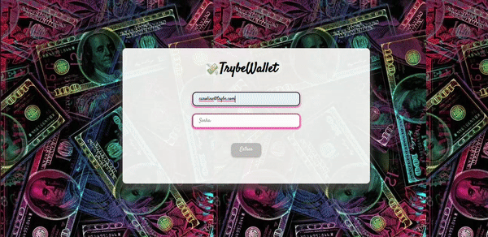

# 💰📝 Projeto Trybewallet 📝💰
Projeto desenvolvido no módulo de Front-end do curso da [Trybe](https://www.betrybe.com/). Neste projeto pude desenvolver uma carteira de controle de gastos com conversor de moedas.

## 📌 Habilidades:
- Realizar operações básicas de criação e manipulação de um estado de Redux;
- Criar store, reducers, actions e dispatchers no Redux;

## 📌 Ao utilizar essa aplicação o usuário deverá ser capaz de:
- Adicionar e remover um gasto;
- Visualizar uma tabela com seus gastos;
- Visualizar o total de gastos convertidos para uma moeda de sua escolha;

### ⬇️ Instalando dependências
  ```
  cd src/
  npm install
  ``` 

### ⚡ Executando a aplicação
Para rodar o front-end:

  ```
  cd src/ && npm start
  ```

### 🧪 Executando os testes
Para rodar todos os testes:

  ```
  npm test
  ```
  
<p align="center">
  
</p>
